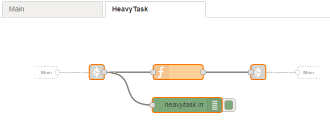

# node-red-contrib-agile-deployer #

This repository contains several nodes related to the deployment of Node-RED
workflows on remote Node-RED instances.

Available nodes:

* tab-deploy: uploads a workflow tab to a remote Node-RED
* cloud-link: performs adaptive jobs offloading depending of device status (CPU, mem or temperature)

## tab-deploy ##

The tab-deploy node uploads a workflow tab to a remote Node-RED instance. The
workflow tab have the following requirements:

* It has a single link-in node as input to the tab.
* It has zero or one link-out node as output of the tab.

The local workflow is unmodified while the remote workflow is slighly modified:

* The link-in node is replaced by a http_in node, with the link-in node ID as
  path
* The link-out node is replaced by a http_out node, allowing the result of the
  workflow to be returned to the caller.

The previous workflow in the remote Node-RED is replaced if exists.

## cloud-link ##

The cloud-link node switches execution flow depending on the device status
(temperature, CPU usage, memory usage). If the thresholds are satisfied,
the execution continues locally through the first input. If not, an HTTP
request is made to a remote URL, using msg.payload as body; the response
is then sent to the second input.

This node is intended to be used in conjunction with the TabDeploy node,
which uploads a workflow 'W' to a remote Node-RED instance. The workflow 'W'
receives input by a linkin node 'LI', and gives output by a linkout node 'LO'.
The first output of the CloudLink node must feed a linkout node pointing
to 'LI'.
The second input must feed a linkout node pointing to the linkin node pointed
by 'LO'.

The remote URL must be the endpoint of the http_in node on the remote 'W',
which is the URL of the remote Node-RED instance / 'LI' ID.

*Note*: The `msg.payload` input to the cloud-link must be a JSON object.

**TODO**

* The device status values are not obtained from the device yet.
These can be set in the `msg` object for the moment.
* Guess the remote URL to send the data to.

## Example ##

The example contains two workflows: Main and HeavyTask.

The HeavyTask workflow represents a task that takes three seconds to complete,
but when executed remotely, it completes immediately.

The Main workflow contains the tab-deploy and cloud-link nodes. The `local` node
injects a temperature value of 0, that makes the cloud-link to process locally.
The `remote` node injects a temperature value of 100, that makes the cloud-link
to process remotely.




1. Prepare a "remote" Node-RED instance. The remote instance in the example is
  at localhost:8000. The local instance is at localhost:1880.
2. Modify the `f1` node to set the "local" URL (default value
  http://localhost:1880/red is suitable for AGILE gateways). Set also
  the user and password if local Node-RED is protected.
3. Trigger the `timestamp` node to export the HeavyTask workflow. The
  resulting workflow is shown below:


4. Modify the `link` node to set the URL of the remote workflow
(in the figure is http://localhost:8000/87e6e86.ebc9f18)

5. Trigger the `local` node. The heavy task will be processed locally.
  The debug from `main.out` appears after 3s.

6. Trigger the `remote` node. The heavy task will be processed remotely.

The full workflow is:
```
[{"id":"47821b99.cda0f4","type":"tab","label":"Main"},{"id":"44b9e650.37a718","type":"tab","label":"HeavyTask"},{"id":"a2d7150a.420f78","type":"ui_tab","z":"","name":"Home","icon":"dashboard"},{"id":"b5076a55.9e6f58","type":"ui_group","z":"","name":"Default","tab":"a2d7150a.420f78","disp":true,"width":"6"},{"id":"b7cfe5db.44eb28","type":"ui_base","theme":{"name":"theme-light","lightTheme":{"default":"#0094CE","baseColor":"#0094CE","baseFont":"Helvetica Neue","edited":true,"reset":false},"darkTheme":{"default":"#097479","baseColor":"#097479","baseFont":"Helvetica Neue","edited":false},"customTheme":{"name":"Untitled Theme 1","default":"#4B7930","baseColor":"#4B7930","baseFont":"Helvetica Neue"},"themeState":{"base-color":{"default":"#0094CE","value":"#0094CE","edited":false},"page-titlebar-backgroundColor":{"value":"#0094CE","edited":false},"page-backgroundColor":{"value":"#fafafa","edited":false},"page-sidebar-backgroundColor":{"value":"#ffffff","edited":false},"group-textColor":{"value":"#000000","edited":false},"group-borderColor":{"value":"#ffffff","edited":false},"group-backgroundColor":{"value":"#ffffff","edited":false},"widget-textColor":{"value":"#111111","edited":false},"widget-backgroundColor":{"value":"#0094ce","edited":false},"widget-borderColor":{"value":"#ffffff","edited":false}}},"site":{"name":"Node-RED Dashboard","hideToolbar":"false","allowSwipe":"false","dateFormat":"DD/MM/YYYY","sizes":{"sx":48,"sy":48,"gx":6,"gy":6,"cx":6,"cy":6,"px":0,"py":0}}},{"id":"eafd3152.6a765","type":"inject","z":"47821b99.cda0f4","name":"local","topic":"","payload":"{ \"temp\": 50 }","payloadType":"json","repeat":"","crontab":"","once":false,"x":104.5,"y":264,"wires":[["3916bd4a.a29902"]]},{"id":"ec425d78.0d75b","type":"link out","z":"47821b99.cda0f4","name":"","links":["87e6e86.ebc9f18"],"x":516.5,"y":255,"wires":[]},{"id":"d5509c15.f11f1","type":"link in","z":"47821b99.cda0f4","name":"","links":["74171b34.701e04","8ac0e3e5.56fdd"],"x":287.5,"y":459,"wires":[["ab96dd7e.3165c"]]},{"id":"ab96dd7e.3165c","type":"debug","z":"47821b99.cda0f4","name":"main.out","active":true,"console":"false","complete":"payload","x":400.5,"y":459,"wires":[]},{"id":"74171b34.701e04","type":"link out","z":"44b9e650.37a718","name":"","links":["d5509c15.f11f1"],"x":535.5,"y":110,"wires":[]},{"id":"87e6e86.ebc9f18","type":"link in","z":"44b9e650.37a718","name":"","links":["ec425d78.0d75b"],"x":212.5,"y":110,"wires":[["1c2d8d1b.957483","398b151e.de8d1a"]]},{"id":"1c2d8d1b.957483","type":"function","z":"44b9e650.37a718","name":"","func":"var remote = msg.payload.remote;\nmsg.payload.msg = remote? \n    \"Executed remotely\" : \"Executed locally\";\n    \nif (!remote) {\n    setTimeout( () => { node.send(msg); }, 3000)\n} else {\n    return msg;\n}","outputs":1,"noerr":0,"x":375.5,"y":110,"wires":[["74171b34.701e04"]]},{"id":"35a6c312.58b74c","type":"inject","z":"47821b99.cda0f4","name":"","topic":"","payload":"","payloadType":"date","repeat":"","crontab":"","once":false,"x":116.5,"y":135,"wires":[["73822c2e.5135b4"]]},{"id":"fc951f24.1a5ac","type":"tab-deploy","z":"47821b99.cda0f4","name":"","tab":"HeavyTask","remote":"http://localhost:8000","x":434.5,"y":134,"wires":[]},{"id":"398b151e.de8d1a","type":"debug","z":"44b9e650.37a718","name":"heavytask.in","active":true,"console":"false","complete":"payload","x":393.5,"y":176,"wires":[]},{"id":"73822c2e.5135b4","type":"function","z":"47821b99.cda0f4","name":"f1","func":"msg.payload = {\n    sourceurl: \"http://localhost:1880\"\n}\nreturn msg;","outputs":1,"noerr":0,"x":268.5,"y":135,"wires":[["fc951f24.1a5ac"]]},{"id":"3916bd4a.a29902","type":"function","z":"47821b99.cda0f4","name":"f2","func":"msg.temp = msg.payload.temp;\nmsg.payload = {\n    timestamp: Date.now()\n}\nreturn msg;","outputs":1,"noerr":0,"x":263.5,"y":318,"wires":[["8bc788bb.59e5f8"]]},{"id":"8ac0e3e5.56fdd","type":"link out","z":"47821b99.cda0f4","name":"","links":["d5509c15.f11f1"],"x":515.5,"y":355,"wires":[]},{"id":"8bc788bb.59e5f8","type":"cloud-link","z":"47821b99.cda0f4","name":"link","cpu":"100","mem":"71","temperature":"86","remote":"http://localhost:8000/87e6e86.ebc9f18","x":390.5,"y":318,"wires":[["ec425d78.0d75b"],["8ac0e3e5.56fdd"]]},{"id":"7c85fa51.b56c24","type":"inject","z":"47821b99.cda0f4","name":"remote","topic":"","payload":"{ \"temp\": 100 }","payloadType":"json","repeat":"","crontab":"","once":false,"x":104.5,"y":378,"wires":[["3916bd4a.a29902"]]}]
```

## License ##

Eclipse Public License v2.0

Maintainer: [Román SG](https://github.com/rosogon)
